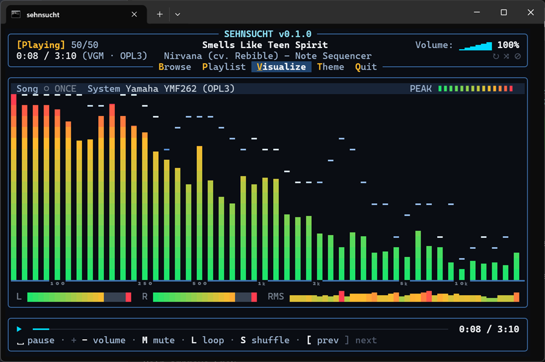
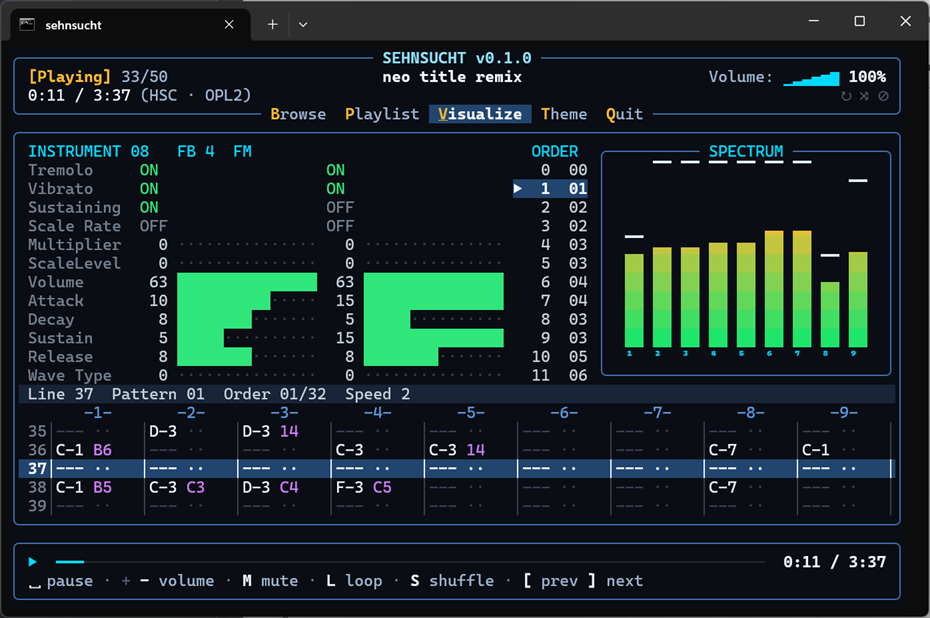

# sehnsucht

A terminal player for classic **OPL2/OPL3** game music.

[](https://github.com/RealBitdancer/sehnsucht/actions/workflows/linux.yml)
[](https://github.com/RealBitdancer/sehnsucht/actions/workflows/macos.yml)
[](https://github.com/RealBitdancer/sehnsucht/actions/workflows/windows.yml)

## What it does

`sehnsucht` plays OPL music files in a terminal UI.

A single file loops until you quit. A track with no native loop point plays
once, pauses at the end, and Space replays it. An M3U playlist advances at
each song end and stops after the last track unless loop (**L**) is on.
Shuffle (**S**) randomizes the order.

FM synthesis is [opal](https://github.com/RealBitdancer/opal) via
[opal-zig](https://github.com/RealBitdancer/opal-zig). Audio out is
[zaudio](https://github.com/zig-gamedev/zaudio) (miniaudio). The TUI is
[libvaxis](https://github.com/rockorager/libvaxis).

Every meter and spectrum band comes from real chip or PCM state. Nothing is
fake visual filler.


**Stream visualizer** (DRO, VGM, IMF, and the other stream formats): full-pane
spectrum, info strip, and master meters.



**Tracker visualizer** (HSC and RAD): pattern, order list, instruments, and
OPL channel meters.



## Why it exists

I built sehnsucht to put [opal](https://github.com/RealBitdancer/opal) through
a real workload. The `examples/player` that ships with opal works, but it is
too small to show what the core can do. A full terminal player was the better
test.

The project grew past that. Formats, playlists, remote loads, visualizers, and
themes kept getting added. At some point I had to stop and release 0.1.0
instead of shipping nothing while features piled up.

The name sehnsucht is deliberate. It reminds me of the Amiga and DOS years,
when the gaming and demo scenes produced impressive work and games still
surprised you.

## The road ahead

sehnsucht is nowhere near feature complete. The seek bar in the status frame is
a clear example: today it only paints elapsed time against duration. It ought
to let you click or drag to an arbitrary position in the track, and it does
not yet.

I also plan to keep adding formats, visualizers, and themes. The plugin layout
is there for that. Contributions of the same kind are welcome (see
[CONTRIBUTING.md](CONTRIBUTING.md)).

## Supported formats

| Format | Extensions / paths | Visualizer | Notes |
|--------|--------------------|------------|--------|
| HSC-Tracker | `.hsc` | tracker | OPL2, fixed 18.2 Hz tick |
| RAD | `.rad` | tracker | Reality Adlib Tracker v1.0 / v2.1 |
| VGM / VGZ | `.vgm`, `.vgz` | stream | OPL-family chips only, GD3 metadata |
| DRO | `.dro` | stream | DOSBox Raw OPL (v1 / early header / v2) |
| RAW | `.raw` | stream | Rdos / RAC raw OPL capture (`RAWADATA`) |
| CMF | `.cmf` | stream | Creative Music File (Sound Blaster) |
| IMF | `.imf`, `.adlib` | stream | Default 560 Hz. Override with `--rate` or R. Modland `ADLIB` metadata wrapper supported |
| WLF | `.wlf` | stream | Default 700 Hz. Override with `--rate` or R |
| AudioT | `AUDIOT.*` / `AUDIO.*` / `AUDIOHED.*` | stream | Muse archives, including Huffman-compressed `AUDIO.*` with an `AUDIODCT.*` dictionary (Keen 4-6). Music chunks are IMF and rate-adjustable like IMF |

Non-OPL VGMs are rejected with a clear message. IMF and WLF do not store a tick
rate in the file. The three rates used by Apogee and id games are **280**,
**560**, and **700** Hz. DRO is a millisecond register capture (including
output from [vgz2dro](https://github.com/RealBitdancer/vgz2dro)).

Per-format layout and quirks: [doc/formats/](doc/formats/).
Adding a format: [doc/adding-a-format.md](doc/adding-a-format.md).
Plugin model: [doc/plugins.md](doc/plugins.md).
Hotkey and playlist-mode conventions:
[doc/hotkeys-and-playlist-modes.md](doc/hotkeys-and-playlist-modes.md).

## Playlists

Pass an `.m3u` or `.m3u8` file instead of a single track. One path per line.
`#` starts a comment. Relative paths resolve against the playlist's location.
Unsupported extensions are dropped.

`#EXTINF` titles name the rows. `#PLAYLIST` names the list on the Playlist
view title line. Without that directive, the playlist file name is used.

Tracks play in order and advance at each song end. With loop (**L**) off, the
list plays through once and stops. With loop on, it wraps at both ends.
Shuffle (**S**) builds a random order with no repeats until the list is
exhausted. **]** and **[** skip forward and back.

In the Playlist view, numbers for tracks already played this session dim, so
you can see shuffle coverage without counting. Failed loads get a red ✗ and
are skipped afterward. A short status-row message names the entry and the
reason. Enter on a marked row retries it. Once the player is running, a load
failure never quits the session.

```sh
zig build run -- playlists/modland.m3u
```

## Remote files

Any file or playlist argument, and any playlist entry, may be an `http://` or
`https://` URL. The bytes download fully into memory (16 MiB cap, redirects
followed, stalls abandoned after 30 seconds without progress), then play like
a local file.

Relative entries in a remote playlist resolve against the playlist URL.
Spaces and similar characters are percent-encoded as needed. Schemes the
player cannot fetch (`ftp://` and the rest) are dropped from playlists and
rejected on the command line. A playlist fetched over http(s) keeps only
http(s) entries, so a remote list cannot point at local files or UNC shares.

Percent-encoded names show decoded in the header and the playlist view
(`dune%201.dro` as `dune 1.dro`). Fetching always uses the URL as written.

`file://` is a spelling of a local path, not a download. It is percent-decoded
and unwrapped before use, including drive forms (`file:///C:/...`,
`file://C:/...`) and UNC (`file://host/share`). It may name a music file, a
playlist, or a directory to browse.

```sh
zig build run -- "https://modland.com/pub/modules/Ad%20Lib/DOSBox/-%20unknown/dune1.dro"
```

Downloads run in the background. While bytes are in flight the status icon is
a spinner, the header reads `[Loading]`, and every key still works. The audio
device stops for the switch, so a slow server delays the next track but does
not glitch the current one. Pressing skip again passes over a slow entry. A
stalled server gives up after 30 seconds without delivering a byte, while a
slow one may take as long as it keeps delivering. Starting with a URL opens
the UI at once and fetches behind the spinner.

## Building

Requires **Zig 0.16.0** (see `.minimum_zig_version` in `build.zig.zon`).

```sh
zig build                 # -> zig-out/bin/sehnsucht[.exe]
zig build test            # run unit tests
```

Default optimize mode is **ReleaseSafe**. Dependencies (opal-zig, libvaxis,
zaudio) are fetched by the package manager on first build.

The UI is truecolor only (24-bit SGR). There is no 256-color or 16-color
fallback. On a console without truecolor (Apple's Terminal.app is the usual
case) the player draws in black and white. Use a terminal that supports
truecolor (iTerm2, Ghostty, Kitty, WezTerm, Alacritty, Windows Terminal, and
most Linux terminals).

## Sample playlists

There is no sample audio in the tree. That keeps redistribution and copyright
out of the repository. Curated remote lists under `playlists/` stream OPL
music over https from Modland's Ad Lib tree and the
[OPL Archive](https://opl.wafflenet.com/). You need network access to play them.

| Path | What |
|------|------|
| `playlists/modland.m3u` | Format showcase with `#PLAYLIST` / `#EXTINF`: HSC, DRO, IMF, ADLIB, VGZ, CMF, RAW, and RAD |
| `playlists/bitdance.m3u` | 50 tracks: Apogee/id IMF with `#EXTINF` `rate=` (280 / 560 / 700), Dune DRO, HSC, and OPL Archive VGZ covers |

```sh
zig build run -- playlists/modland.m3u
zig build run -- playlists/bitdance.m3u
```

Local files and directories work the same way as these lists.

## Usage

```sh
sehnsucht [files... | playlist | directory | URL]
sehnsucht                       # Browse view in the current directory
sehnsucht ~/adlib               # Browse view in the given directory
sehnsucht favorites.m3u         # Playlist view, plays the first entry
sehnsucht a.hsc b.vgm c.dro     # several files become a playlist
sehnsucht ~/adlib/*.hsc         # same, expanded by a Unix shell
sehnsucht https://example.com/tune.vgz
sehnsucht --rate 700 tune.imf
sehnsucht --track 2 AUDIOT.WL6
sehnsucht --version           # -v works too
sehnsucht --help              # -h works too
```

A playlist or directory must be the only argument. Wildcards are the shell's
job, so cmd.exe users must list files explicitly.

```sh
# via the build system (needs network for the sample lists)
zig build run -- playlists/modland.m3u
zig build run -- playlists/bitdance.m3u

# or the built binary
zig-out/bin/sehnsucht song.vgz
zig-out/bin/sehnsucht "https://modland.com/pub/modules/Ad%20Lib/DOSBox/-%20unknown/dune1.dro"
```

### In-player keys

Transport keys are the ones the status frame shows. They work from every view
and every focus state. Nothing else in the player binds them.

| Key | Action |
|-----|--------|
| Space | Pause / resume |
| + / - | Volume up / down, 2.4 dB per press (`=` is also `+`) |
| M | Mute / unmute |
| R | Cycle IMF/WLF/AudioT tick rate 280 → 560 → 700 (rate-adjustable sources only) |
| `,` / `.` | Previous / next music track in an AudioT archive (multi-track only) |
| `]` | Next track (playlists only) |
| `[` | Previous track (playlists only) |
| S | Toggle shuffle (multi-entry playlists, Fisher-Yates, no repeats until exhausted) |
| L | Toggle playlist loop. Off plays through once and stops. On wraps at the ends (a finished shuffle pass reshuffles and continues) |

Everything else is shell navigation.

| Key | Action |
|-----|--------|
| Ctrl+C or Alt+Q | Quit |
| F10 or Alt | Toggle menu focus |
| Alt+B / Alt+P / Alt+V / Alt+T | Activate a menu item directly |
| B (menu focused) | Browse filesystem |
| P (menu focused) | Playlist list view |
| V (menu focused) | Visualizer view |
| T (menu focused) | Open the theme browser |
| Q (menu focused) | Quit |
| Tab / Shift+Tab | Open the next / previous menu view, or focus action-only items |
| ← / → | Parent dir / open selection (Browse, like ranger), or move menu focus. On Windows, parent from a drive root opens a Drives list |
| ↑ / ↓ | Move list cursor (Browse / Playlist) |
| PgUp / PgDn | Page list cursor (Browse / Playlist) |
| Home / End | First / last list entry (Browse / Playlist) |
| Enter | Open dir / play file (Browse), play track (Playlist), or activate the focused menu item |
| Backspace | Parent directory (Browse) |

Where the terminal reports mouse events, click a menu item to open it, click a
list row to select it, click the selected row again to open or play it, and
scroll lists with the wheel.

## Visualizers

Formats pick a named visualizer. The shell is three framed regions with rounded
corners.

- **Header:** brand, menu (`Browse` / `Playlist` / `Visualize` / `Theme` /
  `Quit`), and two title rows with playback state, track metadata, time, and
  volume. Each menu item's emphasized letter is its accelerator. Mode lights
  sit under the volume readout (`↻` loop and `⤨` shuffle on multi-entry
  playlists, `⊘` mute always): amber when on, dim when off.
- **Middle:** visualizer, file browser, playlist, or theme browser. The theme
  browser lists each theme's display name and description, including High
  Contrast for low-vision use.
- **Status frame:** seek bar, duration, and a transport key row underneath.
  Chips that cannot act are dimmed. Toggles show the next action. Space is
  U+23B5 (⎵). Contextual chips appear only when useful (`R rate`, `, . track`,
  playlist loop/shuffle/prev/next). Menu letters are not repeated on the key
  row.

Browse and Playlist panes each end with a navigation key bar when there is
room for it.

| Name | Used by | Presentation |
|------|---------|--------------|
| `tracker` | HSC, RAD | Pattern, order, instruments, OPL channel meters |
| `stream` | VGM/VGZ, DRO, RAW, CMF, IMF/WLF, AudioT | Full-pane PCM analyzer with an info strip (song loop badge, tick rate, source system, peak meter) and a bottom master row (L/R channel meters, running loudness graph) |

## License

MIT. See [LICENSE](LICENSE). Copyright (c) 2026 Bitdancer
(github.com/RealBitdancer).

Third-party code (opal, libvaxis, zaudio/miniaudio) is summarized in
[THIRD_PARTY_LICENSES.md](THIRD_PARTY_LICENSES.md).
